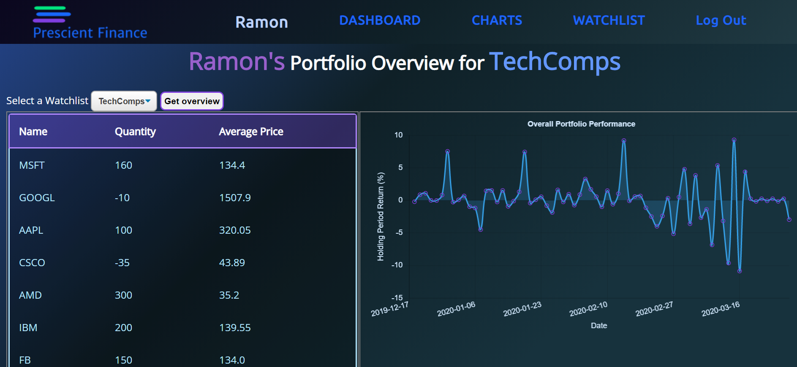
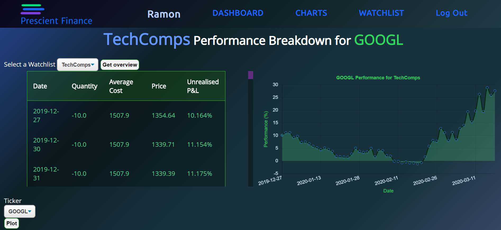

[![Forks][forks-shield]][forks-url]
[![Stargazers][stars-shield]][stars-url]
[![Issues][issues-shield]][issues-url]
[![MIT License][license-shield]][license-url]

# Data App Project (Prescient Finance)
A Web Application that allows users to create dummy portfolios or watchlists to monitor or test their trading strategies. Written in Python using the Flask web framework.
* Front-End: HTML, CSS, JS, ChartJS, Plotly
* Back-End: Flask(Python), SQL-Alchemy, MySQL
* Other Libraries: Pandas

# Table of Contents
- [Introduction](https://github.com/RamonWill/Data-App#Introduction)
- [Features](https://github.com/RamonWill/Data-App#Features)
- [How it Works](https://github.com/RamonWill/Data-App#Installation)
- [Credits](https://github.com/RamonWill/Data-App#Credit)
- [Video Demo](https://github.com/RamonWill/Data-App#Video-Demo)
- [Screenshots](https://github.com/RamonWill/Data-App#Screenshots)

# Introduction
Prescient Finance allows users to create an unlimited number of portfolios/watchlists to test out their strategies, monitor potential performance, or to simply track certain sectors. Users have a choice of over 1500+ equities from 10 different countries.

# Features
Other features of Prescient Finance include:
* Time-series Performance charts at a portfolio and security level
* Daily unrealised P&L breakdowns of their positions
* Perform CRUD operations on their portfolios
* View the daily Holding Period Return on a portfolio
* Statistical graphics to help visualise portfolio exposure.

# How it Works
After Registration and logging in, A user can create a portfolio. The user can then start adding securities to the portfolio and enter the economics of the trade. The site will then display the various features based on the information entered by the user. If the security does not yet have a prices stored in the database, an api call will be made to Alpha Vantage and the last 100 End of Day (EOD) prices will be stored to the database. EOD prices are updated before midnight on every weekday.

# Credits
A big thank you to the Flask community for designing an interesting and flexible Framework. I would also like to thank Alpha Vantage again for the easy access to a wide range of financial data. Finally, a special thanks to the Pandas/Numpy community, Miguel Grinberg and the SQL-Alchemy Community.

* Disclaimer: This project is not valid financial tool. It is a project that I've created to help me learn more about Python. You should in no way use it to make investment decisions.

# Video-Demo
The image below will redirect you to the video demo on Youtube

# Screenshots

[forks-shield]: https://img.shields.io/github/forks/RamonWill/Data-App.svg?style=for-the-badge
[forks-url]: https://github.com/RamonWill/Data-App/network/members
[stars-shield]: https://img.shields.io/github/stars/RamonWill/Data-App.svg?style=for-the-badge
[stars-url]: https://github.com/RamonWill/Data-App/stargazers
[issues-shield]: https://img.shields.io/github/issues/RamonWill/Data-App.svg?style=for-the-badge
[issues-url]: https://github.com/RamonWill/Data-App/issues
[license-shield]: https://img.shields.io/github/license/RamonWill/Data-App.svg?style=for-the-badge
[license-url]: https://github.com/RamonWill/Data-App/blob/master/LICENSE.txt
